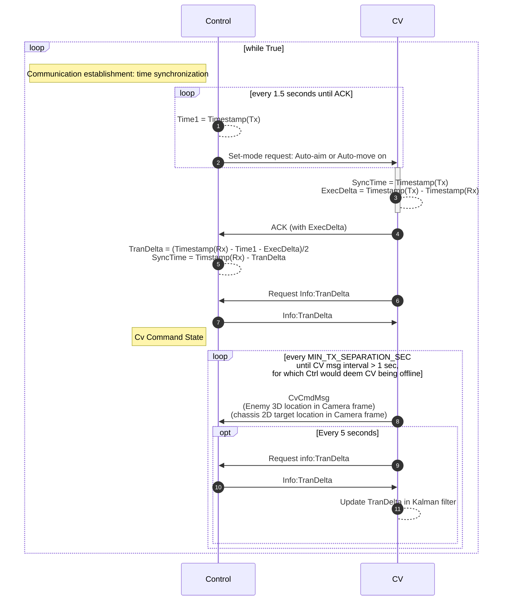

# CV_Interface
Communication layer API for computer vision (CV) to connect with control board

CV requirement for python version: 3.6.9

## Signal Conditioners
### Camera pixel to angle conversion
Reference: https://www.cs.cmu.edu/~16385/s17/Slides/11.1_Camera_matrix.pdf
### Camera frame to Control board IMU frame conversion
Alternative IMU solutions:
- **(Current setup)** Camera must have its own IMU to measure its orientation. The orientation of camera frame is different from the orientation of control board IMU frame. Therefore, the target 3D point in camera frame must be converted into control board IMU frame. We are free to do it on CV side before sending or control side after sending. For now, it's easier to do it on control side, because it's easier for Ctrl to find the transformation matrix during calibration process.
- CV and Ctrl can share the same IMU. In this case, the orientation relationship with Camera and IMU should be hardcoded into CV, and target position should be converted into IMU frame before sending to Ctrl. Finally, Ctrl would not need to do any conversion.

Control board should use its current IMU location, target location sent by CV and initial projectile speed setting to calculate the projectile direction as the setpoint for gimbal motors.

Typically, we fix control board to the same orientation as the cannon, so omit the difference in cannon frame and control board IMU frame. 

@TODO: To have good precision, control would better have a cascaded feed-forward & feedback control strategy to ensure the initial projectile speed. One of the feedbacks should be Referee system's projectile speed measurement. Its actuator would better be CAN-bus controlled M3508 without reduction gears. We must wait until friction wheels to reach certain speed before loading projectiles to shoot every time. And relation between this wheel speed and the actually measured initial speed should be estimated and feed-forwarded for future shots.

(WIP)

## Data Packages
### Control to CV
(WIP)
### CV to Control
(WIP)

## Sequence Diagrams
### Normal CV command process

### Gimbal frame calibration process

## Circuit Diagram

## Jetson TX2 Special Circuit Connection (Obsolete)
This picture is obsolte, please use USB-to-TTL dongle instead. Because the UART Tx port on Jetson TX2 is not working properly. Its current output capacity is too low that it must use a MOSFET circuit to drive the control board's Rx pin.
- Serial Port : /dev/ttyTHS2
- Resistors below converts control board's 5V level Tx signal down to 3.3V via voltage divider.

